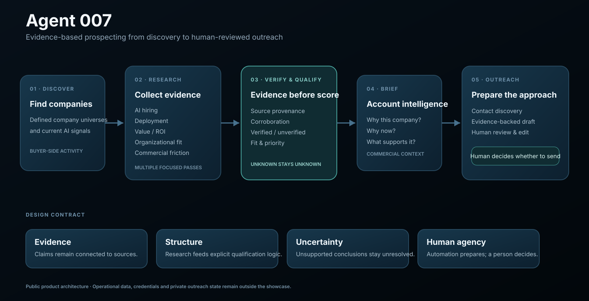

# Agent 007 — AI Prospecting Agent

**Evidence-based B2B prospecting from company discovery to human-reviewed outreach.**

[**grundmind.com**](https://grundmind.com)

> **Public product showcase.** Agent 007 is a working prospecting system built to identify organizations showing meaningful AI adoption and commercial signals relevant to GrundMind. The workflow combines web research, evidence verification, qualification, account intelligence, contact discovery, and human-reviewed outreach.

## What is Agent 007?

Agent 007 turns prospecting from an ad-hoc research task into a structured agentic workflow.

Instead of starting with a company name and manually searching for signs of AI activity, hiring, deployment, value, organizational change, and likely contacts, the system coordinates those steps and produces an evidence-backed account view.

The workflow is designed around a simple principle:

**Find evidence first. Score second. Contact third.**

## The workflow

  

### 1. Discover

Agent 007 starts with candidate organizations rather than assuming every company is worth researching.

Discovery can begin from public company lists or from current AI-related signals. The system is designed to distinguish **organizations adopting AI for their own operations** from AI vendors, consultancies, investors, and other poor-fit categories.

### 2. Research

For a qualified company, focused research passes examine several commercial signals:

- **AI hiring**
- **AI deployment**
- **AI value / ROI**
- **organizational fit**
- **commercial pain or adoption friction**

The goal is not to generate a generic company summary. It is to collect evidence relevant to a specific buying hypothesis.

### 3. Verify evidence

Material claims keep their source and provenance.

Evidence can come from company pages, job postings, press coverage, public announcements, academic material, vendor case studies, and other public sources. Source type and corroboration matter: not every claim deserves the same confidence.

A claim without adequate supporting evidence should remain unverified rather than being upgraded by fluent model output.

### 4. Qualify

The collected evidence is translated into a structured account assessment.

Qualification helps separate:

- companies with credible operational AI activity;
- companies showing measurable value or ROI;
- organizations with adoption or scaling friction;
- poor-fit companies;
- AI vendors and consultancies that should not enter the buyer pipeline.

The scoring layer is designed to make the research process repeatable rather than dependent on an unstructured impression.

### 5. Build the account brief

Qualified evidence is consolidated into an account brief that answers the commercial questions that matter:

**Why this company? Why now? What evidence supports the opportunity? What remains uncertain?**

This becomes the working context for outreach rather than asking the model to improvise a sales message from a company name.

### 6. Find contacts

Agent 007 can identify likely contacts and use contact-enrichment services to support outreach preparation.

Contact data is treated as operational data and is not committed to the public repository.

### 7. Draft outreach

The agent prepares a short, evidence-based first message using the account research.

**A human reviews, edits, and decides whether anything is sent.**

The purpose of automation is to reduce repetitive research and drafting — not to delegate the decision to contact someone.

## A useful lesson from real runs: flip the funnel

An early discovery approach started from broad AI news and asked the system to find matching organizations.

That worked, but repeated runs tended to surface the same prominent companies and a large number of AI vendors.

The workflow was improved by reversing the funnel:

**Start with a defined company universe → remove known companies → research each company for buyer-side AI signals.**

This produced a much more useful prospect pool, including smaller organizations that broad news discovery repeatedly missed.

The lesson is broader than prospecting: **agent quality depends as much on the search space and workflow design as on the model itself.**

## Evidence over eloquence

Agent 007 deliberately separates persuasive writing from factual support.

A strong account brief should be able to distinguish:

- **verified evidence**
- **unverified signals**
- **corroborated claims**
- **source-specific claims**
- **inference**
- **unknowns**

The system should not turn absence of evidence into evidence of absence, and it should not manufacture certainty simply because a complete answer would read better.

## Architecture principles

| Principle | Agent 007 approach |
| --- | --- |
| **Buyer-side signals first** | AI adoption means operational use by the prospect, not simply being part of the AI industry. |
| **Evidence before scoring** | Qualification follows sourced research rather than leading it. |
| **Provenance matters** | Claims retain their supporting sources and evidence type. |
| **Unknown stays unknown** | Unsupported conclusions remain unresolved. |
| **Structured qualification** | Multiple signal families contribute to a repeatable account assessment. |
| **Human-reviewed outreach** | The agent drafts; a person decides what is sent. |
| **Fail locally** | One failed search or weak source should not invalidate an entire research run. |

## Product architecture

At a high level, Agent 007 consists of four layers:

**Prospect Discovery → Evidence Research → Qualification & Account Intelligence → Outreach Preparation**

The current implementation uses:

- **Python / FastAPI** for orchestration and backend services;
- an LLM with web-search capability for research tasks;
- **React + TypeScript** for the operator interface;
- contact-enrichment and email integrations for the final outreach workflow.

The implementation can evolve; the product contract is more important than any single model or provider.

## What this project demonstrates

Agent 007 combines:

**Agentic orchestration** — several focused research tasks contribute to one commercial outcome.

**Evidence handling** — claims remain connected to their public sources.

**Deterministic structure around probabilistic models** — models perform research and interpretation inside an explicit qualification workflow.

**Workflow optimization** — real runs are used to identify bottlenecks and redesign the funnel.

**Human agency** — automation prepares evidence and drafts; commercial decisions remain human.

## Data and privacy

Runtime prospect data, personal contact information, credentials, research logs, and outreach state are operational data and are not part of this public showcase.

Public company information may be used as research input, but private contact datasets and credentials remain outside the repository.

## Status

Agent 007 is an actively developed working tool used to support GrundMind prospect research and outreach.

This repository demonstrates the **agentic architecture, evidence discipline, qualification model, and workflow design** behind the system.

---

**Agent 007**  
*AI Prospecting · Evidence Research · Account Qualification · Human-Reviewed Outreach*

**JD Vellino** · AI Automation Consultant · Agentic AI · Deterministic Workflows
